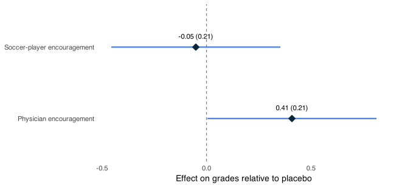

<p class="eyebrow">Empirical application</p>

# Encouragement, iron supplementation, and school performance

<p class="lead">This application uses the AEJapp replication data included with sreg to estimate the effects of two encouragement treatments on school performance. It illustrates data preparation, stratified estimation, covariate adjustment, and reporting.</p>

<div class="guide-language"><span>Implementation</span><div class="language-tabs" role="group" aria-label="Empirical example language"><button type="button" data-select-lang="r" aria-pressed="true">R</button><button type="button" data-select-lang="stata" aria-pressed="false">Stata</button><button type="button" data-select-lang="python" aria-pressed="false">Python</button></div></div>

## 01 · Experimental setting {#setting}

[Chong, Cohen, Field, Nakasone, and Torero (2016)](https://doi.org/10.1257/app.20140494) study an intervention encouraging iron supplementation among students in rural Peru. The two active treatments are videos featuring a soccer player or a physician; the placebo video concerns oral hygiene. Assignment was stratified by year in school. The package's analysis dataset contains **215 students in five strata**.

The outcome, `gradesq34`, measures school performance in the final two academic quarters. The estimands are the average effects of **assignment to each encouragement video**, relative to placebo. They are not the causal effects of consuming iron supplements. This application also appears in [Bugni, Canay, and Shaikh (2019)](https://doi.org/10.3982/QE1150).

| Variable | Definition |
| --- | --- |
| `gradesq34` | Sum of average grades in the final two quarters |
| `treatment` | Original assignment: 1 = soccer player, 2 = physician, 3 = placebo |
| `class_level` | School-year stratum |
| `age_months` | Student age in months |
| `pills_taken` | Realized supplement uptake; not a baseline covariate |

## 02 · Load and prepare the data {#load}

Install the selected implementation using the [installation guide](get-started.md#install). Recode placebo from `3` to `0`, as required by sreg, while retaining the original assignment variable.

<div data-lang="r" markdown="1">

```r
library(sreg)
data("AEJapp", package = "sreg")

# Strip imported Stata labels without changing numeric codes.
Y <- as.numeric(unclass(AEJapp$gradesq34))
D_original <- as.numeric(unclass(AEJapp$treatment))
D <- ifelse(D_original == 3, 0, D_original)
S <- as.numeric(unclass(AEJapp$class_level))
age <- as.numeric(unclass(AEJapp$age_months))

table(D, S)
```

</div>
<div data-lang="stata" hidden markdown="1">

Replace the path with the extracted repository location. Save any current dataset before using `clear`.

```stata
use "/path/to/sreg-stata/data/sreg_aejapp.dta", clear
generate byte D = cond(treatment == 3, 0, treatment)
tabulate D class_level
```

</div>
<div data-lang="python" hidden markdown="1">

```python
from sreg import AEJapp, sreg

aej = AEJapp()
Y = aej["gradesq34"]
D = aej["treatment"].replace(3, 0)
S = aej["class_level"]
X_age = aej[["age_months"]]

print(aej.assign(D=D).groupby(["D", "class_level"]).size())
```

</div>

The treatment–stratum counts are:

| Assignment | Year 1 | Year 2 | Year 3 | Year 4 | Year 5 | Total |
| --- | ---: | ---: | ---: | ---: | ---: | ---: |
| Placebo (`0`) | 15 | 19 | 16 | 12 | 10 | 72 |
| Soccer player (`1`) | 16 | 19 | 15 | 10 | 10 | 70 |
| Physician (`2`) | 17 | 20 | 15 | 11 | 10 | 73 |
| Total | 48 | 58 | 46 | 33 | 30 | 215 |

## 03 · Estimate the unadjusted ATEs {#unadjusted}

Use individual-level assignment and the large-strata procedure. Without covariates, the point estimator aggregates treatment–control contrasts within strata using sample stratum shares. The standard errors use the stratified-design variance estimator, with HC1 enabled by default.

<div data-lang="r" markdown="1">

```r
fit_unadjusted <- sreg(Y = Y, S = S, D = D)
print(fit_unadjusted)
```

</div>
<div data-lang="stata" hidden markdown="1">

```stata
sreg gradesq34, treatment(D) strata(class_level)
estimates store unadjusted
```

</div>
<div data-lang="python" hidden markdown="1">

```python
fit_unadjusted = sreg(Y=Y, S=S, D=D)
print(fit_unadjusted)
```

</div>

| Encouragement versus placebo | Estimate | Standard error | p-value | 95% confidence interval |
| --- | ---: | ---: | ---: | --- |
| Soccer player | −0.05113 | 0.20645 | 0.80440 | [−0.45577, 0.35351] |
| Physician | 0.40903 | 0.20651 | 0.04763 | [0.00427, 0.81379] |

The physician-encouragement estimate is approximately 0.41 grade units. Its marginal 95% interval narrowly excludes zero; the soccer-player interval includes zero. These are separate asymptotic tests, without adjustment for multiple testing. The empirical results alone cannot establish the coverage properties of an inference procedure.

<figure class="empirical-figure"><figcaption>Unadjusted estimates and marginal 95% asymptotic confidence intervals, computed with R sreg 2.1.0.</figcaption></figure>

## 04 · Covariate adjusted inference {#adjusted}

As a baseline-adjusted illustration, include age in months. The randomization strata remain `class_level`; adding an adjustment covariate does not change the original stratification design.

<div data-lang="r" markdown="1">

```r
fit_age <- sreg(Y = Y, S = S, D = D,
                X = data.frame(age_months = age))
print(fit_age)
```

</div>
<div data-lang="stata" hidden markdown="1">

```stata
sreg gradesq34 age_months, treatment(D) strata(class_level)
estimates store age_adjusted
```

</div>
<div data-lang="python" hidden markdown="1">

```python
fit_age = sreg(Y=Y, S=S, D=D, X=X_age)
print(fit_age)
```

</div>

| Encouragement versus placebo | Estimate | Standard error | 95% confidence interval |
| --- | ---: | ---: | --- |
| Soccer player | −0.03420 | 0.19160 | [−0.40972, 0.34133] |
| Physician | 0.34380 | 0.19575 | [−0.03986, 0.72747] |

Both standard errors are smaller in this sample, and both intervals include zero. Adjustment choices should follow the analysis specification, rather than the statistical significance of a realized estimate.

<details markdown="1"><summary>Reproduce the repository's two-covariate specification</summary>

The repository examples include both `pills_taken` and `age_months`. The following code reproduces that specification. Because pills taken measures uptake after treatment assignment, this is a software-replication exercise; it should not be interpreted as baseline adjustment identifying the total effect of encouragement.

<div data-lang="r" markdown="1">

```r
X_repository <- data.frame(
  pills_taken = as.numeric(unclass(AEJapp$pills_taken)),
  age_months = age
)
fit_repository <- sreg(Y = Y, S = S, D = D, X = X_repository)
print(fit_repository)
```

</div>
<div data-lang="stata" hidden markdown="1">

```stata
sreg gradesq34 pills_taken age_months, treatment(D) strata(class_level)
estimates store repository_specification
```

</div>
<div data-lang="python" hidden markdown="1">

```python
fit_repository = sreg(
    Y=Y, S=S, D=D,
    X=aej[["pills_taken", "age_months"]],
)
print(fit_repository)
```

</div>

The repository specification gives estimates −0.02862 and 0.34609, with standard errors 0.18162 and 0.18572, respectively.

</details>

## 05 · Extract and plot results {#report}

The following commands report the unadjusted specification. Use the corresponding stored result to report the age-adjusted specification.

<div data-lang="r" markdown="1">

```r
data.frame(
  estimate = fit_unadjusted$tau.hat,
  se = fit_unadjusted$se.rob,
  lower = fit_unadjusted$CI.left,
  upper = fit_unadjusted$CI.right
)
plot(fit_unadjusted,
     treatment_labels = c("Soccer-player encouragement",
                          "Physician encouragement"),
     title = NULL,
     x_axis_title = "Effect on grades relative to placebo")
```

</div>
<div data-lang="stata" hidden markdown="1">

```stata
estimates table unadjusted age_adjusted, b(%9.5f) se(%9.5f) stats(N)
estimates restore unadjusted
matrix list e(b)
matrix list e(V)
sregplot, treatmentlabels("Soccer player" "Physician")
```

</div>
<div data-lang="python" hidden markdown="1">

```python
print(fit_unadjusted["tau_hat"])
print(fit_unadjusted["se_rob"])
ax = fit_unadjusted.plot(
    treatment_labels=["Soccer-player encouragement", "Physician encouragement"],
    title="Encouragement effects on school grades",
    x_axis_title="Effect on grades relative to placebo",
)
ax.figure.savefig("peru-effects.png", dpi=150, bbox_inches="tight")
```

</div>

## Sources and replication {#sources}

The data and core examples come from the [R repository](https://github.com/jutrifonov/sreg), [Stata repository](https://github.com/jutrifonov/sreg-stata), and [Python practical guide](https://github.com/jutrifonov/sreg-python/blob/main/docs/getting-started.md). Numerical tables and the figure on this page were computed using R sreg 2.1.0. The age-only adjustment is an additional illustration; the two-covariate repository specification is reproduced separately above.

- Chong, A., Cohen, I., Field, E., Nakasone, E., and Torero, M. (2016). [Iron Deficiency and Schooling Attainment in Peru](https://doi.org/10.1257/app.20140494). *American Economic Journal: Applied Economics*, 8(4), 222–255.
- Bugni, F. A., Canay, I. A., and Shaikh, A. M. (2019). [Inference under Covariate-Adaptive Randomization with Multiple Treatments](https://doi.org/10.3982/QE1150). *Quantitative Economics*, 10(4), 1747–1785.

See the [design map](index.md#designs) for other assignment structures and the [user guide](get-started.md) for simulated examples and argument conventions.
